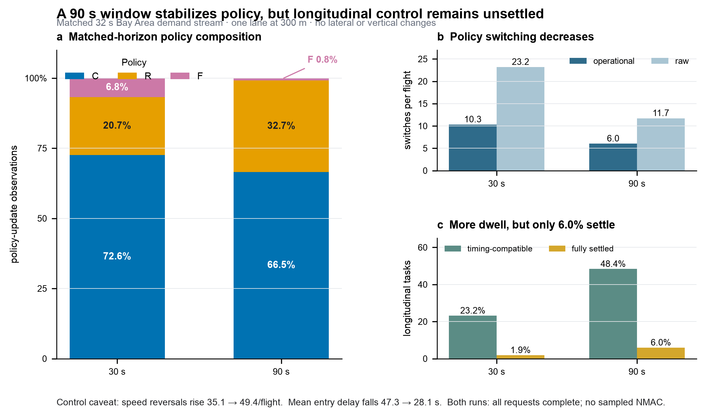

# Confirmed Step 03 revision 02 — verified 90 s single-lane baseline

**Status:** completed, independently replayed, and confirmed on 2026-09-12 as
the matched longitudinal baseline for the next same-altitude three-lane study.

## Fixed experiment

The experiment uses the real `airport_to_airport` route, one lane at 300 m,
one global requested arrival every 32 s, longitudinal control only, and no
lateral or vertical motion. The fixed policy parameters are:

| Parameter | Value |
|---|---:|
| SINR threshold | -2.0 dB |
| Radio sampling / policy update | 2 s / 5 s |
| Assessment window | **90 s** |
| C/R bad exposure | 5% / 10% |
| Persistence | k=3 |
| Group | focal aircraft + up to two neighbours each side |

Aircraft count is a derived run record, not the experiment label. The finite
demand horizon generated 93 requests in R0048, and all 93 completed.

## Confirmed result

| Measure | 30 s, R0040 | 90 s, R0048 |
|---|---:|---:|
| Matched-horizon C/R/F | 72.55/20.68/6.77% | 66.46/32.71/0.83% |
| Operational switches per flight | 10.31 | 6.02 |
| Raw switches per flight | 23.18 | 11.72 |
| Timing-compatible tasks | 23.2% | 48.4% |
| Fully settled tasks | 1.9% | 6.0% |
| Gap-error-improved tasks | 77.3% | 87.1% |
| Speed-direction reversals per flight | 35.09 | 49.38 |

The 90 s window meets its classification objective: fallback and both forms of
policy switching decrease, while timing compatibility approximately doubles.
The removed fallback is mainly redistributed to reactive, not coordinated.
Completion and sampled-safety gates pass, with no sampled NMAC.

This result **does not** establish that the longitudinal controller is settled.
Only 33 of 552 applicable spacing tasks fully settle before the next policy
change, and speed-direction reversals increase despite more stable policy labels.
The next three-lane comparison must therefore report settling and speed reversals
alongside policy shares and lane-change benefit.

## Confirmed next stage

Use this exact 90 s configuration in a matched same-altitude three-lane pair at
300 m: lane changing disabled versus enabled, with the same global requested
arrival stream. Add multiple height levels only after that gate is complete.

## Canonical evidence

- [R0048 report](../../../reports/R0048.md)
- [R0048 run archive](../../../runs/R0048/)
- [Fixed configuration](../../../configs/bay_area_longitudinal_90s_demand.json)
- [Staged protocol](../../../bay-area-90s-staged-protocol.md)
- [Full figure/source bundle](../../../figures/R0048/)

The copied validation record, source table, presentation PNG/SVG, source hashes,
and authorization scope are preserved in this revision. No Git commit or push
was made.
