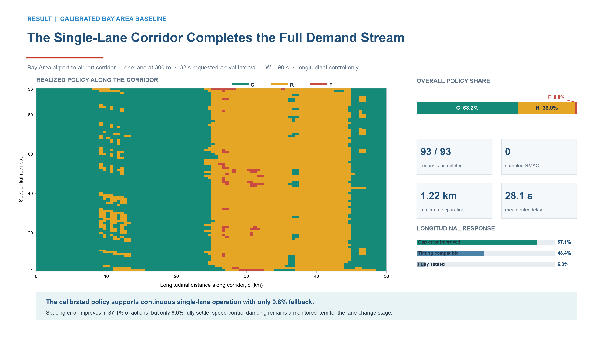

# Confirmed Step 03 revision 03 — external single-lane result

**Status:** current external presentation result, confirmed on 2026-09-12.

## Test

The calibrated policy was applied to the real Bay Area airport-to-airport
corridor using one lane at 300 m, one global requested arrival every 32 s, and
longitudinal control only. The fixed settings were `Theta=-2.0 dB`, 2 s radio
sampling, a **90 s assessment window**, 5 s policy updates, 5%/10% bad-exposure
limits and `k=3` persistence.

## Result

| Measure | Result |
|---|---:|
| Completed requests | 93/93 |
| C/R/F policy share | 63.2/36.0/0.8% |
| Sampled NMAC | 0 |
| Minimum sampled horizontal separation | 1.22 km |
| Mean entry delay | 28.1 s |
| Gap-error-improved actions | 87.1% |
| Timing-compatible actions | 48.4% |
| Fully settled actions | 6.0% |

## Conclusion

The fixed policy supports continuous single-lane operation of the complete
requested-arrival stream with negligible fallback. This result becomes the
baseline for the same-altitude three-lane lane-change study. Longitudinal
settling and speed-control damping remain monitored outcomes; no capacity claim
is made.

The request count is a derived run result, not the experiment name. The external
figure reports only the final fixed configuration and its absolute outcomes.
Prior parameter-selection evidence remains internal and is not part of this
briefing revision.

## Canonical evidence

- [Briefing note](../../../reports/R0048-briefing.md)
- [Full internal report](../../../reports/R0048.md)
- [R0048 run archive](../../../runs/R0048/)
- [Fixed configuration](../../../configs/bay_area_longitudinal_90s_demand.json)
- [Full figure/source bundle](../../../figures/R0048/)

The copied presentation PNG/SVG, source table, validation record and hashes are
preserved in this revision. No Git commit or push was made.
