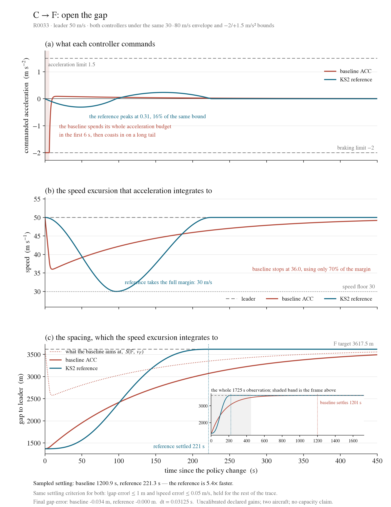
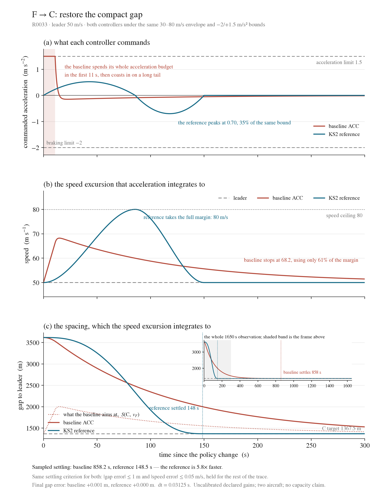

# Step 04 — policy-gap recovery, revised ACC comparison

**Current revision: R0033, 2026-09-10.** Updated at the user's explicit request
to restore ACC acceleration, rerun the comparison, regenerate the figures and
refresh Confirmed. The previous R0032 presentation is retained in the parent
folder as historical evidence; its controller-ranking interpretation is superseded.
This records authorization for the correction and update, not a separate claim
that the user has reviewed every new numerical result.

## What the corrected experiment establishes

Both ACC and AKS now open and close all six policy gaps within the same final
tolerances. For an established follower–leader pair, ACC uses signed gap and
relative-speed feedback without the nominal-cruise veto. It retains physical
bounds and the constraints from other occupied-lane leaders. A distant unbound
leader does not trigger pursuit: the 4500 m hold case stays at 50 m/s.

For F → C, ACC peaks at **68.22 m/s**, then returns toward 50 m/s. With the same
1 m gap / 0.05 m/s speed settling criterion, it settles in **858.2 s**; AKS settles
in **148.5 s**. For C → F the corresponding times are **1200.9 s** and **221.3 s**.
These timings use unchanged gains and a common observation endpoint T+1500 s.
T is the AKS reference duration, not ACC completion time.

The old claim that ACC opening permanently stops short is withdrawn: its opening
trajectories are unchanged over the R0032 observation interval and continue
converging when observed longer. Both the original T+120 s errors and the new
terminal errors are recorded in the table. No error tolerance was relaxed.

## How to read the two figures

Both figures use the same three panels, in the order **acceleration, speed, gap**.
Each panel is the integral of the one above it, so a bounded acceleration is
visibly turned into a speed excursion, and the speed excursion into the spacing
change. That order is the point of the figure: the controllers differ in which
budget they spend, and the difference is only legible if the second derivative is
read first.

| | acceleration budget used | speed margin used | settling |
|---|---|---|---|
| C→F baseline | **100 %** — on the −2.0 limit for 6 s | 70 % (36.0 m/s against a 30 m/s floor) | 1200.9 s |
| C→F reference | 16 % (peak 0.31) | **100 %** (exactly 30.0 m/s) | 221.3 s |
| F→C baseline | **100 %** — on the +1.5 limit for 11 s | 61 % (68.2 m/s against an 80 m/s ceiling) | 858.2 s |
| F→C reference | 35 % (peak 0.70) | **100 %** (exactly 80.0 m/s) | 148.5 s |

The two controllers reach the same spacing by spending opposite resources. The
baseline converts the spacing task into an acceleration demand, saturates that
bound within seconds, and then approaches on a long first-order tail with most of
its speed margin still unused. The reference converts the same task into a speed
excursion, uses that margin to its limit, and never comes close to the
acceleration bound. That is why the settling ratio is about 5.5× in both
directions while the final spacing is the same.

The x window is set from the dynamics rather than from the observation endpoint.
Both runs are observed for T + 1500 s, but plotting all of it compresses every
curve into the left tenth of the frame. The full timescale is kept as an inset on
the gap panel, with both settling times marked and the plotted window shaded, so
the long baseline tail is shown rather than cropped away.

## Figures and complete results

- [All six transitions and six variants](results-table.md), with [CSV](results-table.csv).
- [Full R0033 report](../../../reports/R0033.md).
- [Config](../../../configs/two_uam_longitudinal_recovery.json) and [protocol A6–A7](../../../two-uam-longitudinal-protocol.md).
- [Immutable run with source snapshot](../../../runs/R0033/) and [figure provenance](../../../figures/R0033/revision-02/manifest.json).
- [Independent saved-trace validation](validation.json): **72 traces, zero failed checks, 48/48 refinement comparisons**. Full repository test run: **255 passed**.

## Scope

Two prescribed aircraft on a straight route with perfect leader observation,
30–80 m/s nominal envelope and +1.5/−2 m/s² limits. The source snapshot is a
validated development version; gains, spacing assumptions and vehicle bounds are
not calibrated to a particular aircraft. The pair fixture explicitly supplies an
existing following relationship. Automatic full-corridor relationship management,
a complete passage through a fallback zone, string stability and capacity are
not established here.

AKS is not declared universally correct: in the leader-braking-during-opening
variant it invalidates its reference, and both methods retain a policy-gap deficit
(ACC 416.41 m, AKS 652.26 m against the instantaneous target). That diagnostic
remains outside the successful nominal recovery comparison.
