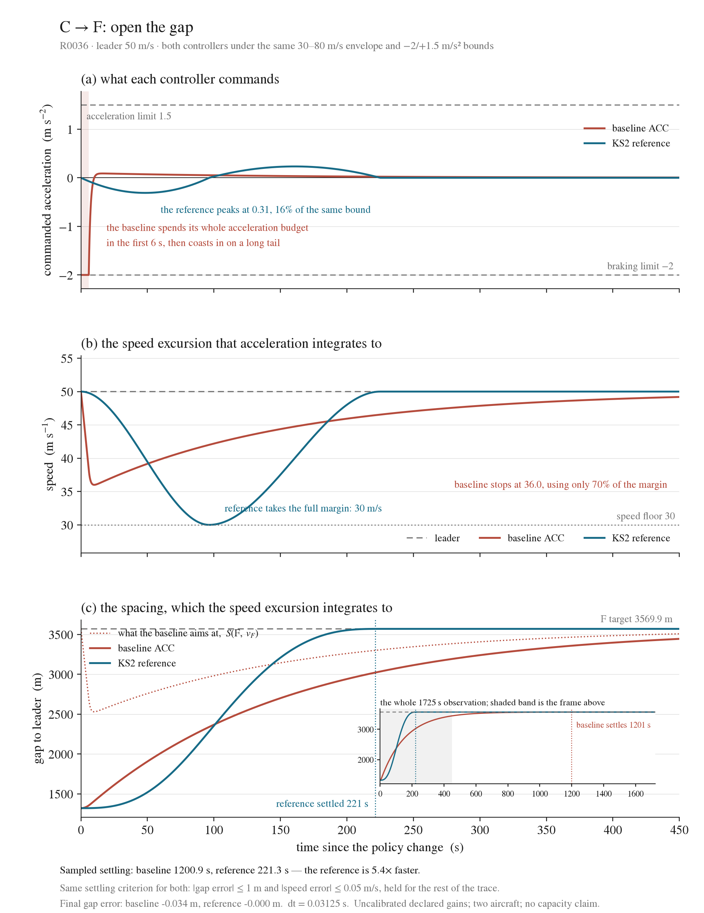
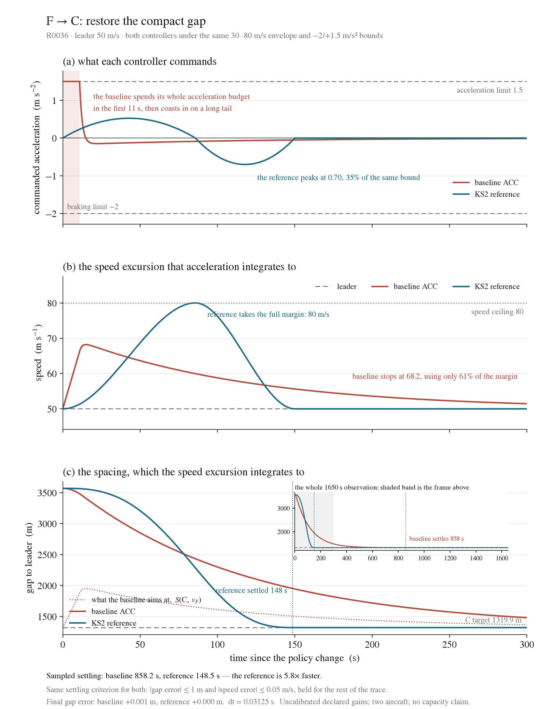

# Step 04 — longitudinal policy-gap recovery, spacing constant anchored to NMAC

**Current revision: R0036, 2026-09-11.** Same experiment as revision-03, rerun
with one parameter changed: the residual spacing constant d0 in

    S(policy, v) = d0 + tau(policy) * v + 0.167 * v^2

becomes **152.4 m**, the NMAC horizontal threshold (HMD <= 500 ft, joint with
VMD <= 100 ft; Chen 2019), replacing the uncited 200 m the project had been
using. Nothing else changed: tau, the quadratic term, the gains, the twelve
cases, the step sizes and every acceptance threshold are those of R0033.

This records the user's authorization to change the constant and update
Confirmed. It is not a separate statement that every new number was reviewed.

## Why the constant changed

200 m had no source. Anchoring d0 to NMAC gives the spacing law a stated
meaning: after the leader brakes as hard as it can and the follower responds
tau seconds later, the two are still no closer than the near-mid-air-collision
boundary. The margin against uncertainty then sits entirely in the policy
headway tau*v, which is the quantity this research varies. tau (15/30/60 s) and
the 0.167 s^2/m term remain project assumptions, not calibrated values.

Step 2 (five-aircraft lane change, R0035) uses the same law, so both steps now
share one spacing definition.

## What the numbers do and do not change

Equilibrium spacings at 50 m/s fall by 47.6 m: **C 1319.9 m, R 2069.9 m,
F 3569.9 m** (previously 1367.5 / 2117.5 / 3617.5).

The comparison itself is unchanged. Both controllers still reach all six policy
equilibria within the same tolerances, and the KS2 reference remains about 5.5x
faster in both directions:

| Transition | KS2 settling | ACC settling |
|---|---:|---:|
| C -> F | 221.3 s | 1200.9 s |
| F -> C | 148.5 s | 858.2 s |
| C -> R | 73.8 s | 829.1 s |
| R -> C | 50.7 s | 731.2 s |
| R -> F | 147.5 s | 1137.5 s |
| F -> R | 99.0 s | 921.0 s |

Every qualitative statement of revision-03 survives: the corrected ACC
accelerates during established-pair closing, does not pursue an unbound
sufficient-gap leader, and AKS settling sooner is not a universal controller
ranking.

## Figures and complete results

- [All six transitions and six variants](results-table.md), with [CSV](results-table.csv).
- [Config](../../../configs/two_uam_longitudinal_nmac.json) and [protocol A6-A7](../../../two-uam-longitudinal-protocol.md).
- [Immutable run with source snapshot](../../../runs/R0036/) and [figures](../../../figures/R0036/).
- [Independent saved-trace validation](validation.json): **72 traces, zero failed checks**.
- Step 2, which now shares this spacing law: [R0035 report](../../../reports/R0035.md).

## Scope

Unchanged from revision-03. Two prescribed aircraft on a straight route with
perfect leader observation, 30-80 m/s envelope and +1.5/-2 m/s^2 limits; gains
and vehicle bounds are not calibrated to a particular aircraft; the fixture
supplies an existing following relationship. Corridor-wide relationship
management, a complete fallback-zone passage, string stability and capacity are
not established here. NMAC fixes the residual constant only; it is a safety
modelling convention, not a separation regulation.
