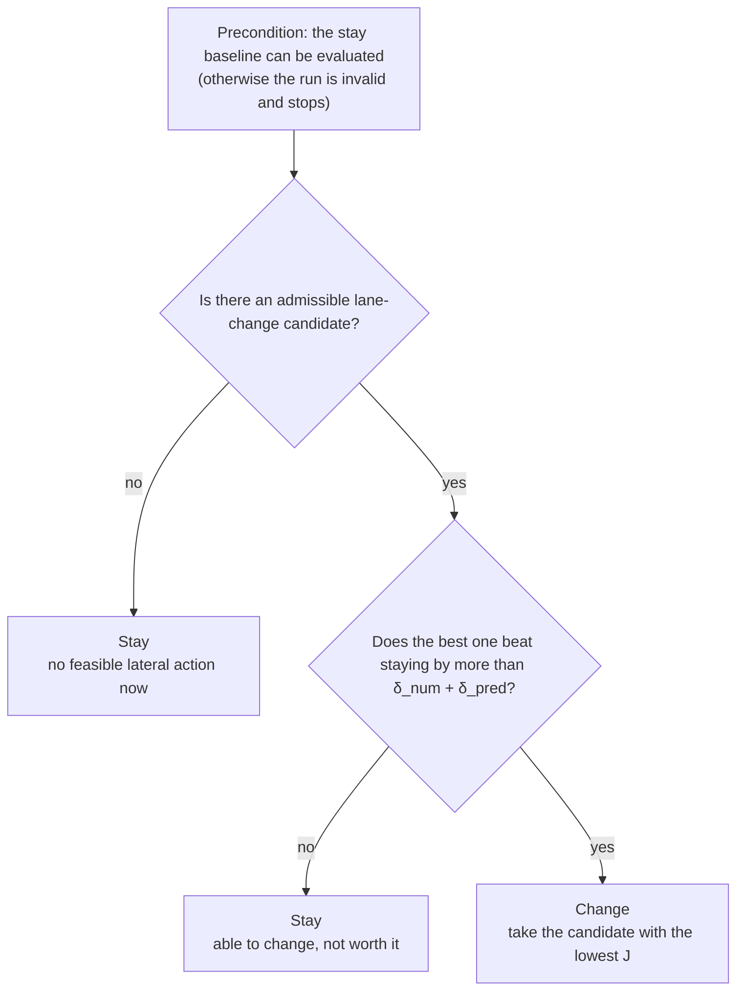

# Lane change under communication degradation: slow down or change lane?

Research protocol, first frozen 2026-09-10 and amended up to 2026-09-14. The
experiment is the five-aircraft, two-lane study (R0034, R0035, R0063). This
English version replaces the original working notes; amendments are kept in the
order they were made and no acceptance threshold was loosened in any of them.

## Problem

A short stretch of poor link quality can require aircraft flying through it to
open their spacing. An aircraft can do this by slowing down, but the adjustment
is slow and propagates to the aircraft behind. If the adjacent lane has better
link quality, a lane change may reduce the effect of the degradation. The
adjacent lane may already be occupied, and the aircraft cannot add unlimited
lateral motion while it is braking. The question is therefore: **at each
decision instant, should this aircraft change lane or not?**

Policy means the operating requirement implied by the link state, including the
spacing to keep. A better signal does not restore the policy immediately; the
exposure history over the assessment window still counts.

## Approach

The study uses AKS longitudinal control throughout (no ACC arm). An AKS
stay-in-lane run is kept as the control for every scenario.

There are only two actions, applied in a rolling way:

| Action at this instant | What the aircraft does | When it can be right |
|---|---|---|
| Stay | continue AKS longitudinal control and adjust speed and spacing | the own lane can be flown at acceptable cost, the adjacent lane is not feasible now, or the benefit is not clear |
| Change | coordinate longitudinal speed and lateral motion and execute the first segment | the adjacent lane is feasible now and clearly better than staying |

"Change later" is not a third action. Only the first segment is executed and the
decision is re-evaluated, so a later change appears as "stay" at several
decision instants followed by "change".

A lane change must pass the admission checks **and** improve on staying by more
than the numerical error band. If either fails, the aircraft stays, and the two
reasons (cannot / not worth it) are recorded separately.

## Decision rule



The stay baseline is a counterfactual prediction: keep the lane, keep flying
AKS, over the same prediction horizon. It is both the reference for the benefit
and the action executed when the aircraft stays.

The cost compared is

    J(c) = Σ_{i ∈ affected aircraft} ∫ c_policy(p_i(t)) dt,   c(C) = 0, c(R) = 1, c(F) = 2,

integrated to a common horizon over the same set of affected aircraft for the
stay baseline and every candidate.

Admission is a filter applied **before** ranking: every candidate must keep the
joint motion-envelope utilisation η ≤ 1, have no protection-volume incursion
over its whole prediction, and leave a state that can be maintained. Ranking is
done only on the filtered set. A candidate that is cheaper but not admissible is
never chosen.

### Why the stay baseline is a precondition, not a branch

An earlier draft treated a truncated or undetermined stay prediction as a
separate branch with an absolute criterion. That branch was removed. A deep
policy-spacing deficit does not make the baseline unusable: in R0033's frozen
state the deficit was 2119.5 m, yet the stay trajectory never came closer than
1367.5 m. It is legal, it runs the full horizon and its cost is comparable; it is
only expensive. A lane change must win on computed cost, not by exemption.

An earlier argument that a stay trajectory can never cross the protection
volume (spacing loss = decision period × Δv) was wrong and is withdrawn: with
both aircraft at 50 m/s and the C spacing, a leader braking at 1 m/s² to 30 m/s
brings the gap down to 954.0 m even with zero decision delay. The controller is
following a shrinking target, because S(C, v) itself falls with speed
(1367.5 m at 50 m/s, 800.3 m at 30 m/s under the constant then in use). The
structural lower bound is min_v S(C, v) = S(C, 30), independent of traffic.

Handling adopted: every scenario is checked in advance by running its stay
baseline through the continuous trajectory checks; scenarios that fail are out
of scope and are not given a branch; if the precondition still fails at run
time, the run stops and is recorded as a defect. A collision-avoidance layer is
a separate concern (as in NASA DAIDALUS) and is not part of this decision.

### Algorithm 1 — rolling change/stay decision (one aircraft, every control period)

```
 1  every control period:
 2      update state, policy history and following relationships
 3      c_stay ← predict stay (AKS longitudinal, no lateral motion)
 4      if c_stay is not evaluable: record defect and stop the run
 5      if no re-evaluation is needed and the current plan still passes: execute its first segment; continue
 6      C_lc ← predicted lane changes over the feasible durations (and start times)
 7      C_lc ← { c ∈ C_lc : η(c) ≤ 1, no protection-volume incursion, post-manoeuvre state sustainable }
 8      if C_lc = ∅: stay, reason = no admissible candidate
 9      C_g ← { c ∈ C_lc : J(c_stay) − J(c) > δ_num + δ_pred }
10      if C_g = ∅: stay, reason = gain below threshold
11      c* ← argmin over C_g of J(c)
12      if c* starts in the future: stay, reason = best candidate starts later (no commitment kept)
13      else: change along c*
14      execute one control period; if the reference becomes invalid, fall back to feedback control and record it
```

Lines 8, 10 and 12 all output "stay" and must record different reasons. Lines 7
and 9 are two independent gates; the mixed candidate set below tests that they
are not merged.

When a decision flips during a manoeuvre, lateral position, speed and
acceleration may not jump. The default is `commit`: once lateral motion starts
it runs to the end of the segment, aborting only on a protection trigger.

When a policy change invalidates an AKS reference (for example an F→C upgrade
at t = 100 s during a C→F opening, when v ≠ cruise and the gap must also close),
the aircraft falls back to feedback control. The fallback has no analytic
guarantee; in R0033's leader-braking case the AKS fallback ended with a 652 m
residual against 416 m for ACC. Extending KS2 to Δv ≠ 0 and ΔS ≠ 0 at once is
future work.

## Test design

Scenarios are built as positive, negative and boundary cases of the two
predicates:

| Predicate | Negative case | Positive case |
|---|---|---|
| a lane change is admissible now | shrink the target-lane gap, raise the closing speed, or exhaust the joint envelope | leave enough gap and lateral margin |
| a lane change clearly beats staying | adjacent lane no better, or the own lane recovers soon | adjacent lane clearly better and own-lane recovery slow or costly |

Mandatory combinations:

| Combination | Expected action | Why |
|---|---|---|
| not admissible, large benefit | stay (cannot) | a large benefit with no admissible candidate; catches an implementation that ranks before filtering |
| mixed candidate set: admissible candidate J = 90, inadmissible candidate J = 0, stay J = 100 | change, choosing the admissible one | catches "sort then filter" |
| admissible, no benefit | stay (not worth it) | no manoeuvre without benefit |
| admissible, benefit | change | normal case |
| neither, own lane costly | stay | the frozen state is reported, not forced |
| precondition fails (constructed) | run stops, recorded as defect | not a silent decision |

"Change later" is tested as a predicate flipping during the run: an admissible
gap that appears later, lateral margin that appears later, or a benefit that
disappears because the own lane recovers.

## Restored step 2 settings (2026-09-10)

The earlier straight five-aircraft regression proved a lane change could be
executed but had one candidate, no stay control, no curve comparison, a 50 m
test protection volume and 100 m lane spacing. On the real Bay Area route two
lanes 100 m apart see almost the same signal, so the timing effect of the curve
cannot be measured there; the study returned to a straight corridor.

| Item | Previous | This step | Reason |
|---|---|---|---|
| Lane separation | 100 m | **300 m** | matches the three-stream layout; avoids a lane spacing below the horizontal protection |
| Admission volume | 50 m / 30 m test fixture | 200 m / 100 m, later **152.4 m / 30.48 m (NMAC)**, see amendment 10 | |
| Exposure group | two ahead, two behind | also along-track distance ≤ S(F, cruise) | a far aircraft's link cannot change a spacing already kept |
| Candidates | immediate quintic at twice the minimum duration | shape × duration factor | |
| Control | none | a stay-in-lane run for every scenario | |
| Shapes | quintic | quintic, r-kernel, three-clothoid | 8 Sept e-mail item 3 |

### Lane-change shapes

All shapes are exact polynomial pieces, so integration and separation checks
remain exact root finding.

| Shape | Definition | Role |
|---|---|---|
| Quintic | r(2,2): lateral speed ∝ u²(1 − u)² | baseline |
| r-kernel | lateral speed ∝ u^p(1 − u)^q, integers p, q ≥ 2; the KS1A kernel of the AKS manuscript applied to lateral position | timing: r(3,2) late, r(2,3) early |
| Three-clothoid | Oh et al. (AVEC 2022; IEEE TCST 2025): curvature piecewise linear in arc length with G2 ends and equal end segments, transcribed to the corridor frame as piecewise-linear lateral acceleration in time, end segments f = 0.25 | curvature-based comparator |
| Cubic Bézier | from R0063, replaces r(3,3); see amendment 11 | |

The quintic is the r-kernel with p = q = 2. The clothoid transcription error is
at most 1.26% (heading ≤ 9.09° at 8 m/s lateral and 50 m/s along track).

### Signal inputs

| Layer | Tests | Setting |
|---|---|---|
| A prescribed policy | decision logic | an own-lane interval set to F, C elsewhere |
| B sharp SINR boundary | whether curve timing changes the signal flown | own lane (y < 150 m) −20 dB inside the weak zone, +20 dB elsewhere |
| C Bay Area magnitudes | how much of B survives at real magnitudes | SINR = θ − δ + (δ + m)·min(1, ((q − c)/R)²) + γ·y/100, θ = −1.5 dB, δ = 0.7 dB, m = 2.0 dB, bad length 700 m and 1650 m, γ = 0.05 and 0.16 dB/100 m |

Layer C parameters come from the 2026-09-10 survey of the airport_to_airport
route within ±900 m lateral: weak-zone centres −1.84 to −2.43 dB, bad lengths
175–1650 m, in-zone lateral change per 100 m median 0.05 dB and 95th percentile
0.16 dB. They are not tuned to results. At 300 m lane separation only about 32%
of the centreline weak-zone length has an exit in the adjacent lane, and those
exits sit 0.01–0.09 dB above threshold.

### Experiment plan

| Part | Signal | Shapes | What |
|---|---|---|---|
| A decision logic | prescribed policy | quintic | predicate cases, mandatory combinations, precondition negative case, flips; each with a stay control |
| B1 same conditions | sharp boundary | all | same 300 m in the same 90 s: peak lateral speed, acceleration and jerk, midline crossing time, policy cost |
| B2 own feasible durations | sharp boundary | all | each shape at its own minimum duration × 1, 1.5, 2 |
| C real magnitudes | Bay Area magnitudes | as B | as B |

Integration step dt = 0.5 s.

### Pre-run trial findings (2026-09-11)

1. **Scenarios declare their initial following relationships** (`established_pairs`).
   In layers B and C the leader sits 4000 m ahead, beyond the group bound and the
   F spacing; without the declaration the ego aircraft chased it. With it, all
   five shapes pass admission, the ego stays at 50 m/s, and cost ordering follows
   the midline crossing exactly. Each second earlier out of the weak signal saves
   about two weighted aircraft-seconds.
2. **Decision phase is not part of the gain threshold.** Integration error at
   dt 0.5/0.25 was 0.000, prediction error 0.750; shifting the decision phase by
   1 s lowered the gain linearly by 2.00. That is the real cost of deciding later,
   identical for stay and change at the same instant, so it cancels in the
   comparison and is reported separately as time resolution.

## Numerical thresholds, fixed before the first run

| Check | Threshold |
|---|---|
| Lateral displacement quadrature | ≤ 0.05 m |
| Lateral acceleration finite difference | ≤ 0.005 m/s² |
| Lateral step refinement | curve ≤ 0.05 m, endpoint ≤ 0.02 m |
| Joint envelope | η ≤ 1.0, tolerance 1e-6 |
| Normalised protection margin | ≥ 1.0 pass; < 1.0 reject; unresolved interval = undetermined |
| Gain | improvement > δ_num + δ_pred |

Longitudinal thresholds are R0033's: quadrature 0.3 m, finite difference
0.05 m/s², curve 0.2 m, endpoint 0.1 m. After Stage 0 each trajectory threshold
becomes min(declared, max(10 × measured Stage-0 difference, 1e-6)); thresholds
may only tighten. δ_num (integration, decision phase) and δ_pred (predicted
against executed J) are measured separately before the formal cases.

## Fixture corrections before R0034 (2026-09-11)

Cases A4–A6 were meant to create "cannot now, can later" by starting the
adjacent-lane rear aircraft slower, but its cruise control returned it to
50 m/s within seconds. They were rebuilt as policy-driven flips: the rear
aircraft starts 2000 m back inside an adjacent-lane F zone, so insertion needs
S(F, 50) and fails; after 40 s it leaves the zone, the requirement drops to
S(C, 50) and insertion becomes admissible. Trial: A4 `future_start` then change
at t = 45 s; A5 `no_admissible_candidate` then `gain_above_threshold` at 45 s;
A6 `no_admissible_candidate` then `gain_below_threshold`. Expected outcomes and
thresholds unchanged; recorded in `fixture_revisions`. The verifier's policy
cost integral was changed from trapezoidal to step integration to match the
sample-and-hold policy.

## Rule changes before R0035 (2026-09-11, agreed with collaborators)

1. **Aircraft renamed A–E**: A ego (was E), B own-lane leader (L), C own-lane
   follower (B), D adjacent-lane front (NF), E adjacent-lane rear (NR).
2. **Zero longitudinal acceleration during the lane change.** Previously A fell
   back to ACC while occupying two lanes and braked at −1.9 m/s² for the leader it
   was leaving. Now A holds its speed at the start of the lateral move; safety is
   covered by predicting every candidate in full and re-checking every 5 s.
3. **Crossing the midline counts as entering the new lane** for policy and cost.
   The crossing time of asymmetric shapes is solved analytically and is a step
   boundary. Occupancy of both lanes during the whole move is unchanged.
4. **Unsafe events are recorded, not fatal.** Violations go to `safety_events`
   and the run status becomes `completed_with_safety_events`. Candidate
   filtering is unchanged.
5. **Only "change now" candidates.** Re-deciding every 5 s already covers waiting.
6. **Controller update period fixed at 0.5 s** (`control_period_s`), separate
   from the integration step. In R0034 halving the step also changed the
   controller, and step refinement differed by 0.27–0.74 m with identical
   decisions and costs; this model change is disclosed with those numbers.
7. **Gain threshold 0** in step 2, guarding only against numerical error
   (measured integration and prediction error were both 0). The operational
   minimum worthwhile gain is set with the classifier parameters in step 3.
8. **Time stepping** advances to boundary times directly (merging boundaries
   within 1 ns) and snaps to the requested end, removing a cumulative rounding
   drift that could shift observation times.
9. **Insertion spacing applies only to relationships A itself creates** (A
   behind D, E behind A). The pair A leaves behind (C behind B) has a gap equal
   to the two previous gaps combined, so it only widens; its remaining deficit is
   logged in `policy_deficits` but no longer rejects the lane change.
10. **Protection volume and spacing constant from NMAC.** Any pair: horizontal
    152.4 m and vertical 30.48 m jointly (HMD ≤ 500 ft and VMD ≤ 100 ft). Spacing
    law S(p, v) = 152.4 + τ_p v + 0.167 v². At 50 m/s: C 1319.9, R 2069.9,
    F 3569.9 m; group bound 3569.9 m. NMAC has no margin; the margin against
    uncertainty is the policy headway τ v. τ and 0.167 remain assumptions.

## 11. Cubic Bézier replaces r(3,3) (2026-09-14, before R0063)

**Reason.** r(3,3) differs from the quintic only by a higher exponent and has no
physical interpretation to present. The curve families discussed on 1 September
were quintic, Bézier and clothoid. A clamped quintic Bézier is identical to the
quintic, so the cubic Bézier is used.

**Shape.** Control points (0,0), (1/3,0), (2/3,1), (1,1), linear in the
along-track parameter; at constant along-track speed s(u) = 3u² − 2u³, lateral
speed ∝ u(1 − u). Lateral speed is zero at both ends but s″(0) = 6 and
s″(1) = −6: lateral acceleration **steps** at the start and end (C1, not C2).
That is the contrast with the other four shapes, which are C2 at the ends.

**Execution.** The integrator integrates shape jerk from the actual state and
would erase the starting step. At the manoeuvre start and end (already forced
step boundaries), if the shape's one-sided acceleration differs from the state
by more than 1e-9, the state acceleration is set to the shape value and a
`lateral_acceleration_step` event is recorded. C2 shapes have zero one-sided
end acceleration and are unaffected. `LateralProfile.sample` and the verifier's
reference use the right limit at the start.

**Verification.** Only the single interval ending at a declared step instant is
excluded from the trapezoid-average acceleration comparison, and only when the
shape's end acceleration is non-zero. All other checks, thresholds and the
tightening rule are unchanged.

**Configuration.** `configs/five_uam_lateral_step2_bezier.json`, identical to
`five_uam_lateral_step2.json` except for the shape list. The R0035
configuration is unchanged.
