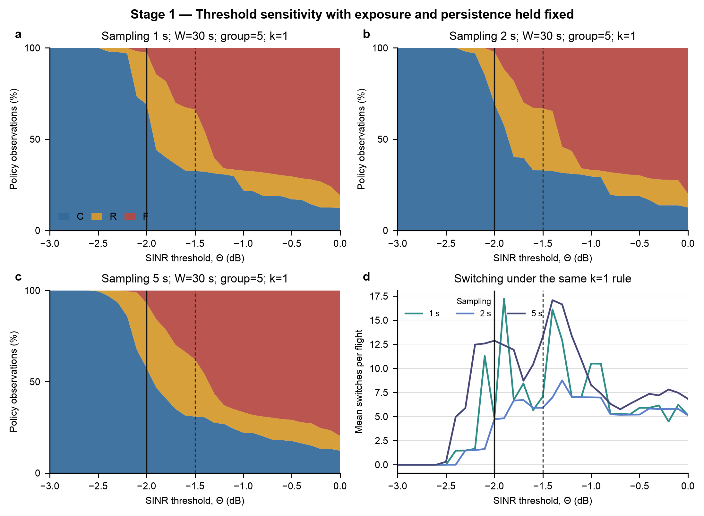
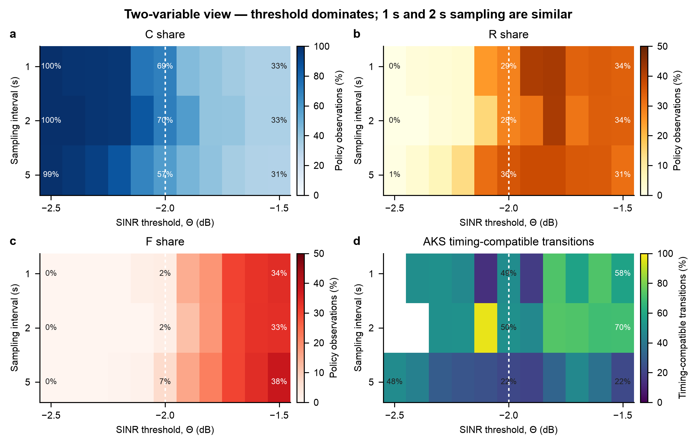
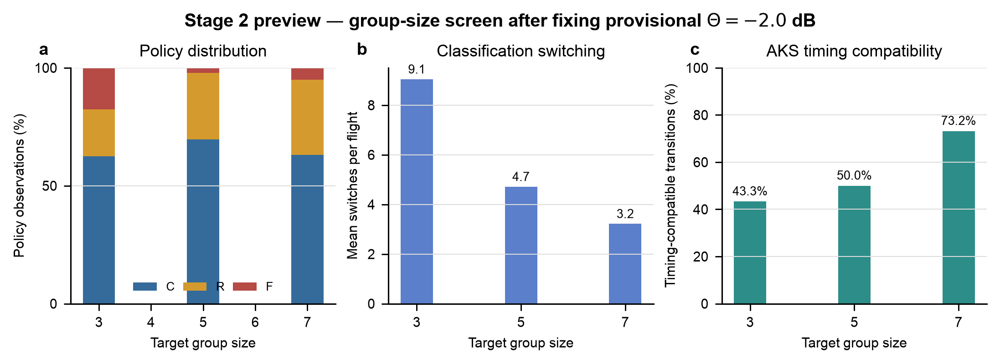
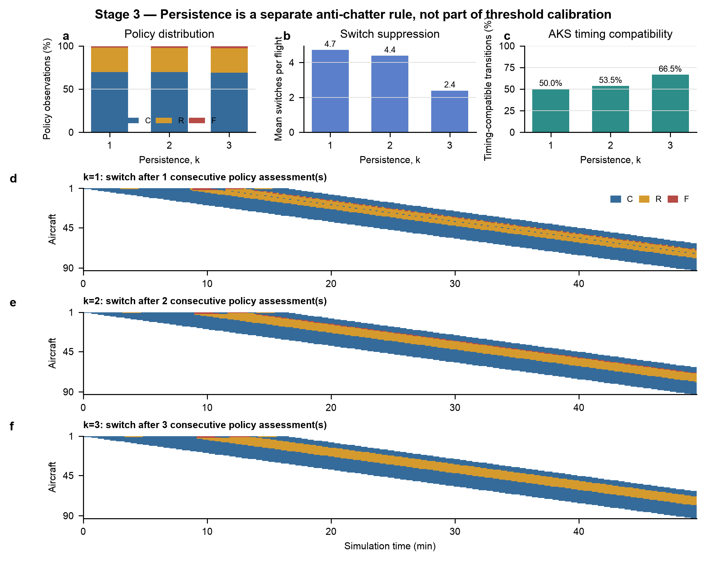

# C/R/F Policy Calibration Results and Recommended Settings for the Bay Area UAM Scenario

**Technical note for ASU–Toyota discussion**  
**Initial calibration:** September 11, 2026  
**Assessment-window follow-up:** September 12, 2026

## Executive summary

This note reorganizes the Bay Area policy calibration as a staged experiment. The previous overview compared a legacy configuration (`5 s, k=1`) with a candidate configuration (`1 s, k=3`), so two variables changed simultaneously. That comparison was useful for showing the overall improvement but was not a clean parameter-calibration argument.

The revised analysis first holds the assessment window, target group size, exposure tolerances, policy-update interval, and persistence rule fixed. It then varies only the SINR threshold and radio sampling interval. A 2 s radio interval was added between the previously tested 1 s and 5 s cases.

The main findings are:

1. The inherited threshold of -1.5 dB produces approximately 33–38% F policy under all three sampling intervals and does not represent the intended nominal operating mix.
2. A threshold of -2.0 dB produces a C-majority policy field while retaining R observations and limiting F to 2–7% across the 1, 2, and 5 s sampling cases.
3. The 1 s and 2 s sampling results are similar. The 2 s case produces fewer policy switches than 1 s or 5 s near the operating transition and is selected for the next test.
4. The original exposure tolerances remain fixed. They represent at least 95% good member-time observations for C and at least 90% for R.
5. Persistence, denoted by k, was not part of the original TRB classifier. It is a new anti-chatter rule evaluated separately from threshold calibration. The k=3 case gives the most stable timeline and is selected for the next test.

The initial configuration used for the first Bay Area longitudinal test was: `Theta=-2.0 dB`, 2 s radio sampling, `W=30 s`, five-aircraft groups, 5%/10% exposure tolerances, 5 s policy updates, and `k=3`. Subsequent closed-loop tests show that 30 s is too sensitive to be the only window used for sparse or singleton groups. Windows of 90 and 120 s are therefore carried forward as candidates; a final value requires an explicit degradation-detection and recovery-delay test.

## 1. Definitions and fixed conditions

The experiment uses the fixed `airport_to_airport` Bay Area route with 112.5 UAM/h, 300 m altitude, 50 m/s speed, no longitudinal feedback, and no lane change. The current geographic runner's adaptive focal groups and available-history convention are retained.

For the first calibration stage, the following parameters are fixed:

| Parameter | Fixed value |
|---|---:|
| Assessment window, W | 30 s |
| Target group size | 5 aircraft |
| C exposure tolerance | 5% bad observations (at least 95% good) |
| R exposure tolerance | 10% bad observations (at least 90% good) |
| Policy-update interval | 5 s |
| Persistence, k | 1 (immediate classification) |
| Longitudinal/lateral feedback | Disabled |

The SINR threshold is swept from -4 to +1 dB in 0.1 dB computational increments. Radio sampling intervals of 1, 2, and 5 s are compared. The fine grid is used only to locate the model transition; the selected operating threshold is reported to one decimal place.

### What k means

The raw classifier produces a C, R, or F assessment at each 5 s policy update. The persistence parameter requires the same new assessment to appear in k consecutive policy updates before the reported policy is changed:

- `k=1`: switch immediately; this is the original behavior.
- `k=2`: require two consecutive supporting assessments; 5 s minimum confirmation after the first candidate assessment.
- `k=3`: require three consecutive supporting assessments; 10 s minimum confirmation after the first candidate assessment.

Persistence does not change the SINR samples or the exposure equation. It filters short policy excursions after the raw classification has been calculated.

## 2. Stage 1 — Select the SINR threshold

**Figure 1.** The three policy-share panels use identical settings except for the 1, 2, and 5 s radio sampling intervals. Compared with the inherited -1.5 dB threshold, -2.0 dB produces a C-majority field and substantially reduces F. The switching panel shows that 2 s sampling is the most stable of the three cases near the selected threshold.

At the inherited and selected thresholds, the current-runner results are:

| Sampling | Threshold | C | R | F | Mean switches/flight | AKS timing-compatible transitions |
|---:|---:|---:|---:|---:|---:|---:|
| 1 s | -1.5 dB | 32.6% | 33.7% | 33.7% | 7.06 | 57.8% |
| 2 s | -1.5 dB | 32.9% | 33.9% | 33.2% | 5.91 | 69.5% |
| 5 s | -1.5 dB | 30.9% | 31.4% | 37.7% | 13.26 | 21.9% |
| 1 s | -2.0 dB | 69.1% | 28.5% | 2.4% | 4.87 | 48.7% |
| 2 s | -2.0 dB | 69.6% | 28.3% | 2.1% | 4.72 | 50.0% |
| 5 s | -2.0 dB | 57.5% | 35.6% | 6.9% | 12.87 | 21.7% |

The -2.0 dB point is selected because C is the majority state, R remains present, and F is limited without making every observation C. Thresholds at or below approximately -2.5 dB produce almost all C and remove useful policy discrimination.

## 3. Threshold × sampling interaction

**Figure 2.** The heatmaps summarize the joint effect of threshold and sampling while all other settings remain fixed. Threshold controls the overall C/R/F distribution; 1 and 2 s sampling give similar policy shares, whereas 5 s produces more switching and more F around the selected operating region.

The heatmaps confirm that threshold is the dominant variable and that a dense sub-second sampling scan is unnecessary for the next experiment.

## 4. Should the exposure tolerances change now?

No. The first threshold comparison should retain the original tolerances to preserve continuity with the TRB definition and avoid changing two decision rules at once.

However, keeping the percentages fixed does not give identical integer budgets:

| Radio sampling | Five-aircraft observations in 30 s | Maximum bad observations for C | Maximum bad observations for R |
|---:|---:|---:|---:|
| 1 s | 155 | 7 | 15 |
| 2 s | 80 | 4 | 8 |
| 5 s | 35 | 1 | 3 |

This integer effect is reported, but exposure is not jointly optimized with threshold. The original 5%/10% values are retained for the next Bay Area test.

## 5. Stage 2 preview — target group size

**Figure 3.** With threshold and sampling fixed, the five-aircraft group gives the highest C share and the lowest F share. It also preserves continuity with the original TRB group definition and is therefore selected.

| Target group | C | R | F | Mean switches/flight | AKS timing-compatible transitions |
|---:|---:|---:|---:|---:|---:|
| 3 | 62.6% | 19.9% | 17.6% | 9.05 | 43.3% |
| 5 | 69.6% | 28.3% | 2.1% | 4.72 | 50.0% |
| 7 | 63.2% | 31.8% | 5.0% | 3.23 | 73.2% |

Five aircraft are retained as the primary coordination group; the three- and seven-aircraft cases remain robustness comparisons.

## 6. Stage 3 — persistence and timing compatibility

**Figure 4.** Only persistence k changes in this comparison. Increasing k from 1 to 3 removes short policy excursions, reduces mean switching from 4.72 to 2.39 per flight, and produces the clearest policy timeline. Therefore, k=3 is selected for the next Bay Area test.

| k | Minimum confirmation delay | C | R | F | Mean switches/flight | AKS timing-compatible transitions |
|---:|---:|---:|---:|---:|---:|
| 1 | 0 s | 69.6% | 28.3% | 2.1% | 4.72 | 50.0% |
| 2 | 5 s | 69.6% | 28.0% | 2.3% | 4.39 | 53.5% |
| 3 | 10 s | 68.8% | 28.4% | 2.8% | 2.39 | 66.5% |

The timing-compatible fraction increases to 66.5% for k=3. This is a dwell-time screening result; the next closed-loop Bay Area test will measure the realized AKS completion rate directly.

## 7. Assessment-window follow-up after longitudinal testing

The original note fixed `W=30 s` so that threshold, sampling and persistence could be identified separately. The internal open-loop screen included 15, 30, 60 and 120 s, but this comparison was not presented in the first TEMA note; 90 s was not included. The new closed-loop follow-up adds 90 s and directly tests short and sparse arrival streams.

For a singleton group, 2 s radio sampling produces 16 observations in a 30 s window. One bad observation is 6.25% and gives raw R; two bad observations are 12.5% and give raw F. Thus a below-threshold episode of only approximately 2–4 s can create raw F, and those samples remain in the rolling window long enough to pass `k=3` persistence.

| Arrival interval | Window | C | R | F | Operational switches/flight | Speed-direction reversals/flight |
|---:|---:|---:|---:|---:|---:|---:|
| 32 s | 30 s | 66.0% | 15.3% | 18.7% | 13.0 | 16.8 |
| 32 s | 60 s | 56.3% | 31.2% | 12.5% | 14.2 | 17.6 |
| 32 s | 90 s | 57.1% | 33.4% | 9.5% | 10.4 | 15.6 |
| 32 s | 120 s | 57.7% | 36.1% | 6.2% | 8.8 | 13.6 |
| 90 s, singleton | 30 s | 84.8% | 0.0% | 15.2% | 8.0 | 0.0 |
| 90 s, singleton | 90 s | 63.6% | 18.2% | 18.2% | 8.0 | 0.0 |
| 90 s, singleton | 120 s | 52.5% | 47.5% | 0.0% | 8.0 | 0.0 |

For the 32 s short stream, 120 s reduces F by 12.5 percentage points, operational switching by 32%, and acceleration/deceleration direction reversals by 19% relative to 30 s. The response is not monotonic: 60 s increases both operational switching and speed reversal. In the 90 s singleton stream, 120 s removes F but mainly relabels the weak periods as R and does not reduce operational switching. All sparse-stream aircraft remain at 50 m/s because their gaps exceed every commanded spacing target.

A longer window therefore mitigates severity but is not automatically a complete anti-chatter solution. A 90 s window tolerates about 9 s of below-threshold time at the 10% boundary; 120 s tolerates about 12 s. Conversely, after sustained degradation, the rolling history may require approximately 81 s for `W=90 s` or 108 s for `W=120 s` to fall back below the F boundary, before persistence is applied. The next test must measure both detection and recovery delay for controlled 2/4/6/10/15/20 s weak episodes.

## 8. Updated recommendation and next Bay Area test

| Parameter | Recommended value |
|---|---:|
| SINR threshold, Theta | -2.0 dB |
| Radio sampling interval | 2 s |
| Assessment window, W | 90 s primary candidate; 120 s robustness; 30 s dense-stream reference |
| Policy-update interval | 5 s |
| Target group size | 5 aircraft |
| C/R exposure tolerances | 5% / 10% bad observations |
| Persistence | k=3 |

The previously reported 68.8% C, 28.4% R and 2.8% F result belongs specifically to the 30 s open-loop reference. It should not be presented as a final window-calibration result.

The immediate next experiment should retain `Theta=-2.0 dB`, 2 s sampling, 5%/10% exposure, 5 s updates and `k=3`, then compare `W=90 s` and `W=120 s` using controlled weak-episode durations. After one window passes the detection/recovery criterion, the multi-lane experiment should compare longitudinal-only and lane-change-enabled cases under the same departure-interval demand.

## Scope limitation

Threshold, sampling, exposure and persistence are retained working values. The assessment window is reopened by the sparse-flow closed-loop evidence and remains provisional until the controlled detection/recovery test is complete. No capacity conclusion is made here.
